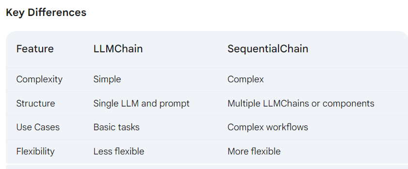

# GenAI: Your One-Stop Shop for Landing Your Dream Job
GenAI is a powerful generative AI web application designed to empower you throughout your new job. We offer a comprehensive suite of tools to help you create a stellar resume for each job , prepare for job interviews with confidence, and ace your mock interview.

1. **Resume Enhancer:** <br>
Our resume enhancer leverages the cutting-edge capabilities of generative AI to take your resume to the next level. Here's what you can expect:
    - *Structured Approach:* Guide the application through your skills, experience, and achievements using a clear, step-by-step process.
    - *AI-Powered Content Generation:* Based on your inputs, GenAI will generate compelling content for each section of your resume, highlighting your strengths and qualifications.
    - *Enhanced Readability:* Benefit from the application's ability to format your resume with a professional structure and ensure easy readability for potential employers.
2. **Interview Preparation:** <br>
GenAI equips you with the resources and guidance you need to shine in your job interviews:
    - *Comprehensive Question Bank:* Access a vast repository of interview questions tailored to various industries and job roles.
    - *AI-Generated Mock Scenarios:* Practice your interview skills by responding to realistic interview scenarios created by the application.
    - *Personalized Tips and Feedback:* Receive feedback on your answers and personalized suggestions to hone your communication and soft skills.
3. **Mock Interviews:** <br>
GenAI provides a realistic mock interview environment to help you build confidence and identify areas for improvement:
    - *Interactive Interview Experience:* Participate in simulated interviews conducted by a virtual AI interviewer.
    - *Personalized Feedback Reports:* Get detailed feedback on your communication style, body language, and overall performance.
    - *Multiple Practice Sessions:* Schedule as many mock interviews as needed to refine your interview techniques and feel fully prepared for the real thing.

## Getting Started with interviewCraft.ai:**
1. Sign up for a free GenAI account.
2. Choose the service you need, whether it's resume enhancement, interview preparation, or mock interviews.
3. Follow the clear and intuitive instructions for each service.
4. Utilize GenAI's powerful AI features to create a winning resume, practice interview skills, and conquer your job search goals.
5. GenAI is your trusted companion on the path to achieving your career aspirations. We empower you to showcase your talents, land that dream job, and embark on a fulfilling career journey!


GenAI - User Flow and Technical Breakdown
This document outlines the user flow and technical details for GenAI, a web application designed to empower job seekers through AI-powered resume enhancement, interview preparation, and mock interviews.

User Flow:

Sign-Up: Users create a free GenAI account, providing basic information for identification and tracking purposes.

Service Selection: Users choose their desired service from three options:

Resume Enhancement
Interview Preparation
Mock Interviews
Service-Specific Instructions: GenAI provides clear and intuitive instructions for each service, guiding users through the process effectively.

AI Interaction: Users leverage GenAI's powerful AI features to:

Resume Enhancement: Upload their resume for AI analysis and generation of an enhanced version.
Interview Preparation: Practice interview skills by responding to AI-generated questions tailored to their specific job description, skills, and experience.
Mock Interviews: Participate in simulated interviews conducted by a virtual AI interviewer, receiving feedback on their performance.
Career Journey Support: GenAI serves as a trusted companion, supporting users in showcasing their talents, landing their dream jobs, and embarking on fulfilling career paths.

Technical Breakdown:

The backend leverages Langchain, a framework facilitating file reading, prompt formatting, memory management, and chaining functionalities across services. Here's a detailed breakdown of each service:

1. Resume Enhancement:

User uploads their resume.
Langchain reads the uploaded file and passes its content to the AI model.
The AI model analyzes the resume content and generates a prompt focused on improvements.
Prompt engineering techniques refine the prompt for optimal results.
The AI model processes the prompt and generates an enhanced version of the resume with suggestions for improvement.
The enhanced resume and any text-based responses from the AI are presented to the user.
2. Interview Preparation:

User selects interview preparation and provides details about the desired job (job description, company).

Langchain manages the prompt creation process, considering the user-provided information and incorporating elements like:

Skills and experience from the user's profile (potentially retrieved from the uploaded resume)
Job description keywords and requirements
The prompt is sent to the Large Language Model (LLM).

The LLM generates interview questions tailored to the specific job description, skills, and experience mentioned in the prompt.

The LLM also generates potential answers to these questions, providing users with a starting point for practicing their responses.

Questions and answers are delivered to the user interface.

3. Mock Interviews:

User chooses mock interview and specifies the number of desired questions.

Langchain utilizes a loop to manage the question-answer cycle.

Within the loop:

The LLM generates interview questions based on the user's profile and job details.
The question is displayed on the user interface.
The user provides their answer through the chat UI.
The LLM validates the user's answer (potentially using pre-defined criteria or comparing it to sample answers).
The LLM provides feedback on the user's answer, highlighting strengths and areas for improvement.
Once the loop completes (all questions answered), the LLM offers a comprehensive feedback report summarizing the user's overall performance.


"scripts": {
    "start": "webpack serve --mode development --open",
    "build": "webpack --mode production",
    "test": "react-scripts test",
    "eject": "react-scripts eject"
  },

  Define Routes 
  /login > craft
  /register >craft
  /craft

  >>conda config --set ssl_verify false 


  https://www.analyticsvidhya.com/blog/2023/10/a-comprehensive-guide-to-using-chains-in-langchain/

# Model 
## ChatGoogleGenerativeAI <br>
Purpose: Interacting with Google's generative AI models, primarily for chat-based interactions.
Functionality: <br>
- Provides a conversational interface with the model.
- Supports features like system prompts, user messages, and assistant responses.
- Often used for tasks like question answering, summarization, and creative writing.
 ## GoogleGenerativeAI <br>
Purpose: A more general-purpose interface for Google's generative AI models.
Functionality: <br>
- Offers broader access to the model's capabilities beyond chat interactions.
- Might include features like text generation, translation, and other tasks.
# Prompts

`PromptTemplate` is a foundational class in Langchain used to structure prompts with variables. It's designed for simple, single-turn prompts. <br>

`ChatPromptTemplate `is a specialized version of PromptTemplate designed specifically for conversational interactions. It handles multiple turns, system prompts, and user/assistant roles, making it suitable for more complex dialogue-based tasks.
## Understanding Chat Prompt Templates
A chat prompt template in Langchain is a structured way to define the conversation flow between a user and an AI model. It typically consists of three key components:

- System prompt: Sets the overall tone, role, and guidelines for the AI assistant.
-User prompt: Represents the user's input or query.
- AI response: The expected output from the AI model.
### Effective Utilization of Chat Prompt Templates in Langchain
**Crafting the System Prompt:** <br>

- Clearly define the AI assistant's role and personality.
- Provide specific instructions or guidelines.
- Consider using few-shot examples to demonstrate desired behavior.
```
from langchain.prompts import ChatPromptTemplate, SystemMessage, HumanMessage

system_message = SystemMessage(content="You are a helpful assistant.")
```

**Incorporating User Prompts:** <br>

- Use placeholders for dynamic user input.
- Ensure clarity and specificity in the prompt.
```
human_message = HumanMessage(content="What is the capital of France?")
```

**Managing AI Responses: (Optional many cases)**

- Use the AI role for AI-generated responses.
- Consider using Assistant role for more advanced scenarios.
```
ai_message = AIMessage(content="Paris")
```

**Combining Components into a Chat Prompt Template:**

- Create a list of messages to represent the conversation flow.
- Use ChatPromptTemplate to combine these messages.
```
chat_template = ChatPromptTemplate.from_messages([
    system_message,
    human_message,
    ai_message
])
```

# Chains

## Understanding the Basics
- LLMChain is a fundamental building block in Langchain. It encapsulates an LLM and a prompt template, allowing you to feed an input and get an output. It's essentially a single step in a larger process.  
    - Simple tasks requiring a single LLM call.   
    - Basic text generation or summarization.
    - When you don't need to chain multiple LLM calls together. 
```
from langchain.llms import OpenAI
from langchain.prompts import PromptTemplate
from langchain.chains import LLMChain

llm = OpenAI(temperature=0.7)
prompt_template = PromptTemplate(input_variables=["text_input"], template="Summarize this text: {text_input}")
chain = LLMChain(llm=llm, prompt=prompt_template)
summary = chain.run("This is a long text that I want to summarize.")

```

- SequentialChain is a more complex chain that allows you to connect multiple LLMChains or other components in a sequential manner. The output of one chain becomes the input for the next, creating a pipeline of processing.   
    - Complex tasks involving multiple LLM calls.
    - Building pipelines for question answering, summarization with refinement, or complex decision-making processes.
    - When you need to pass information between different LLM models or components.

```
from langchain.llms import OpenAI
from langchain.prompts import PromptTemplate
from langchain.chains import LLMChain

llm = OpenAI(temperature=0.7)
prompt_template = PromptTemplate(input_variables=["text_input"], template="Summarize this text: {text_input}")
chain = LLMChain(llm=llm, prompt=prompt_template)
summary = chain.run("This is a long text that I want to summarize.")

```




# API
 **Let's say you're designing an API for a social media platform. How would you handle a sudden surge in traffic during a viral event?**  <br>
 You: "To handle a viral event, I'd employ a multi-layered approach: 
- Load Balancing: Distribute traffic across multiple servers using a load balancer like Nginx.  
- Caching: Cache frequently accessed data like trending topics and user feeds in a distributed cache like Redis. 
- Rate Limiting: Implement rate limiting to prevent abuse and protect the API from being overwhelmed. * - Database Optimization: Optimize database queries and consider using a NoSQL database like Cassandra for handling large volumes of data. 
- Scaling Out: If necessary, scale out our server infrastructure by adding more servers to the pool."
- asynchronous tasks in a high-traffic API: use a message queue like RabbitMQ or Kafka to decouple time-consuming tasks from the main API request flow. 


